# teilchen

- *teilchen* is a simple physics library based on particles, forces, constraints and behaviors. 
- *teilchen* is also a collection of a variety of concepts useful for modeling with virtual physics and behaviors. nothing new, nothing fancy, except maybe for the combination of forces ( *external forces* ) and behavior ( *internal forces* ).
- *teilchen* is also a [processing.org](http://processing.org "Processing.org")-style library.
- *teilchen* is a german word and a synonym for *Partikel* which translates to the english *particle*.

the library is hosted on github [teilchen](https://github.com/dennisppaul/teilchen).

## anatomy of a physic-based particle system

### particles

there are a few different kinds of particles. the most simple particle has just a handful of properties like *position*, *velocity*, *acceleration*, *mass*, and *radius*. other particles have additional properties like a limited lifetime or individual behaviors.

### forces

forces act on particles ( or rather on their acceleration ). one of the most obvious forces is `Gravity` which pulls particles into a specific direction. but there are all kinds of other forces too like `Attractor` or `TriangleDeflector`. some forces affect all particles in a system, while others only act on specific particles. one prominent example of the latter is the `Spring` that tries to maintain a fixed distance between two particles.

### behaviors

a *behavior* is a special kind of force. it is an *internal* force moving the particle from *within* and it affects a single particle only. an common example of a behavior is a `Motor` which drives a particle into a specific direction. another example is the `Seek` behavior which constantly drives a particle towards a certain position.

### constraints

constraints act on particle positions outside of a physical simulation. constraints manipulate the particles’ positions to satifsy specific constraints like for example keeping an equal distance between two particles or keeping particles within a volume. although constraints might seem similar to forces, it is important to know that forces can only *accelerate* particles while contraints directly *teleport* particles which as a rule of thumb is more *effective* but less *realistic*.

### integrators

integrators are used to integrate acceleration and velocity to calculate the new position. the most well-known is the *euler* integrator, but there are also optimized versions like *runge-kutta* or *midpoint* or even slightly different concepts like *verlet*. integrators can affect the precision and stability of a particle simulation.

## anatomy of a particle

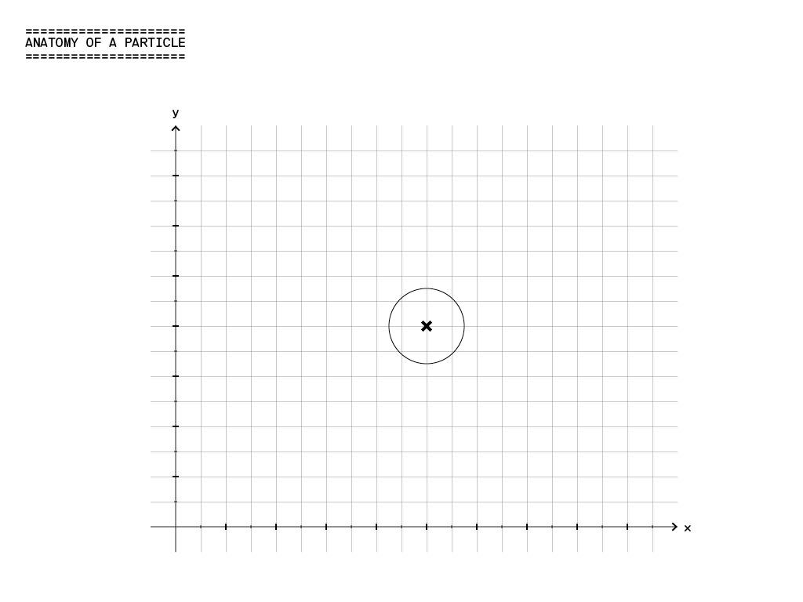

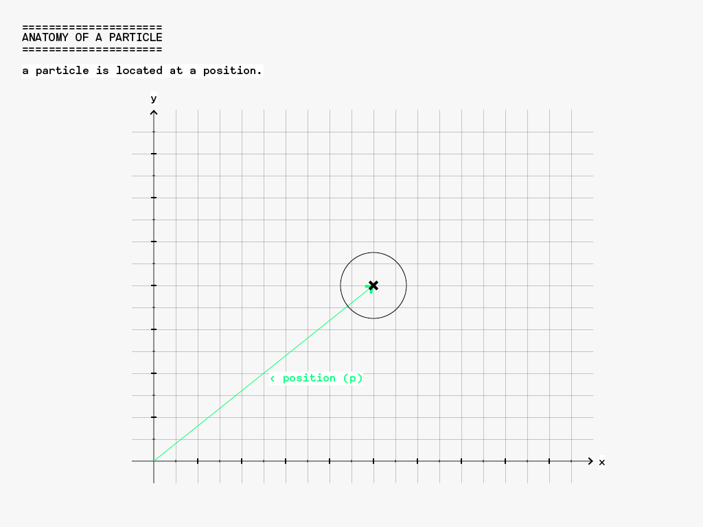

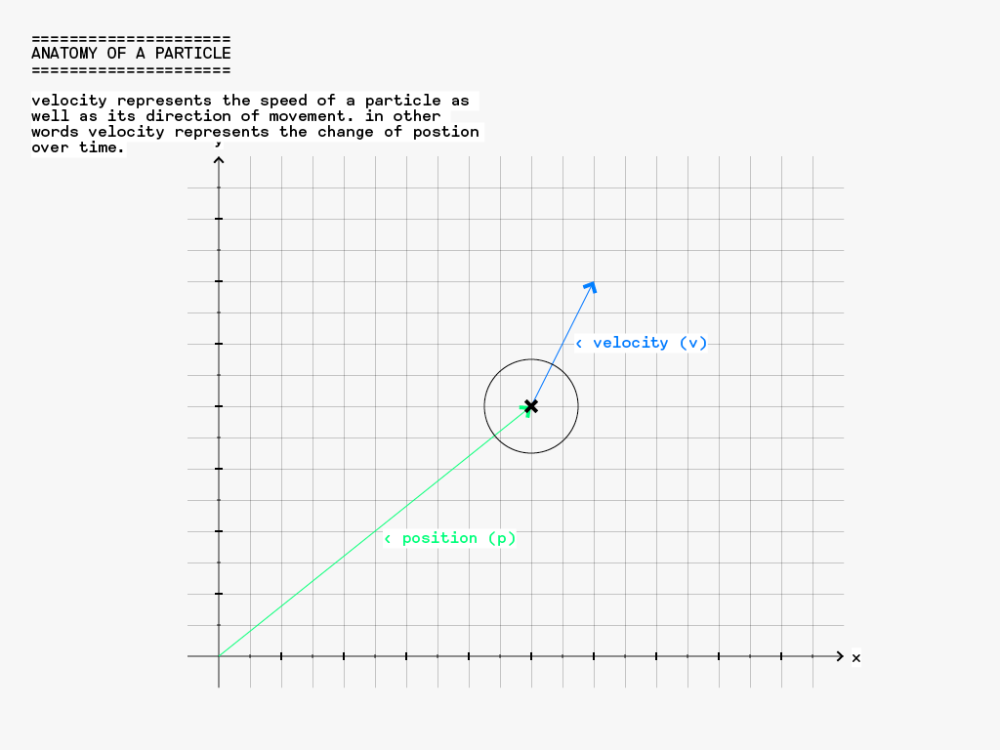

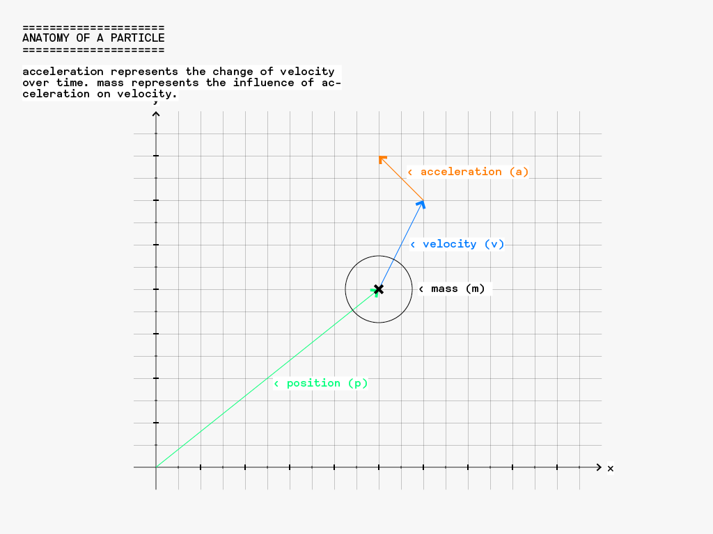

## moving a particle ( with forces )

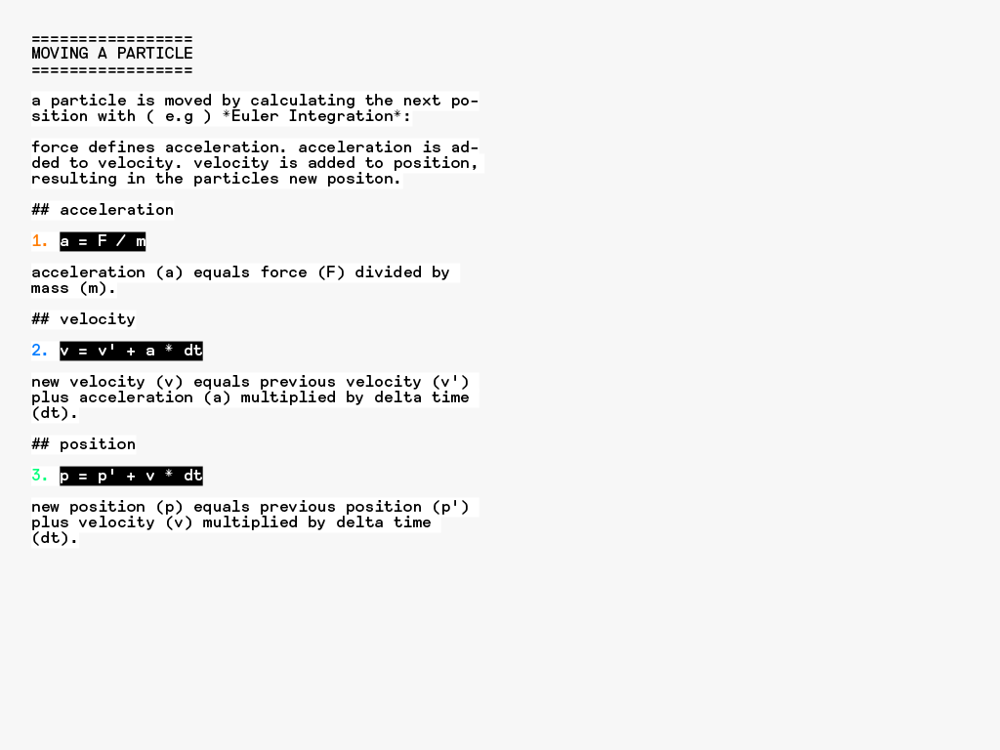

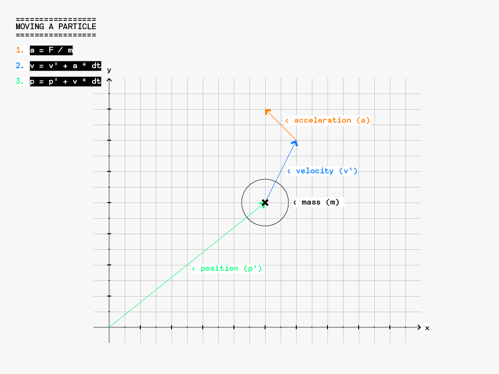

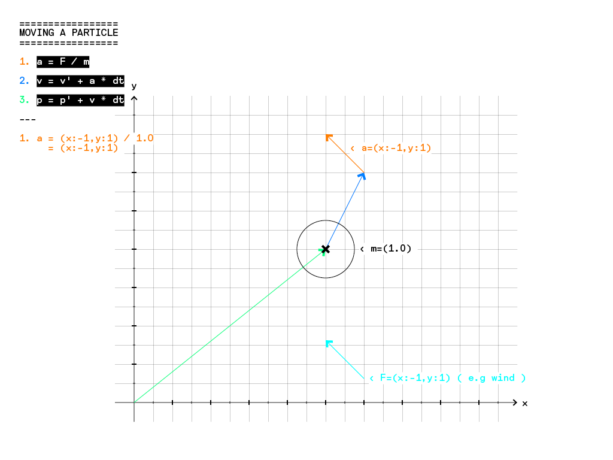

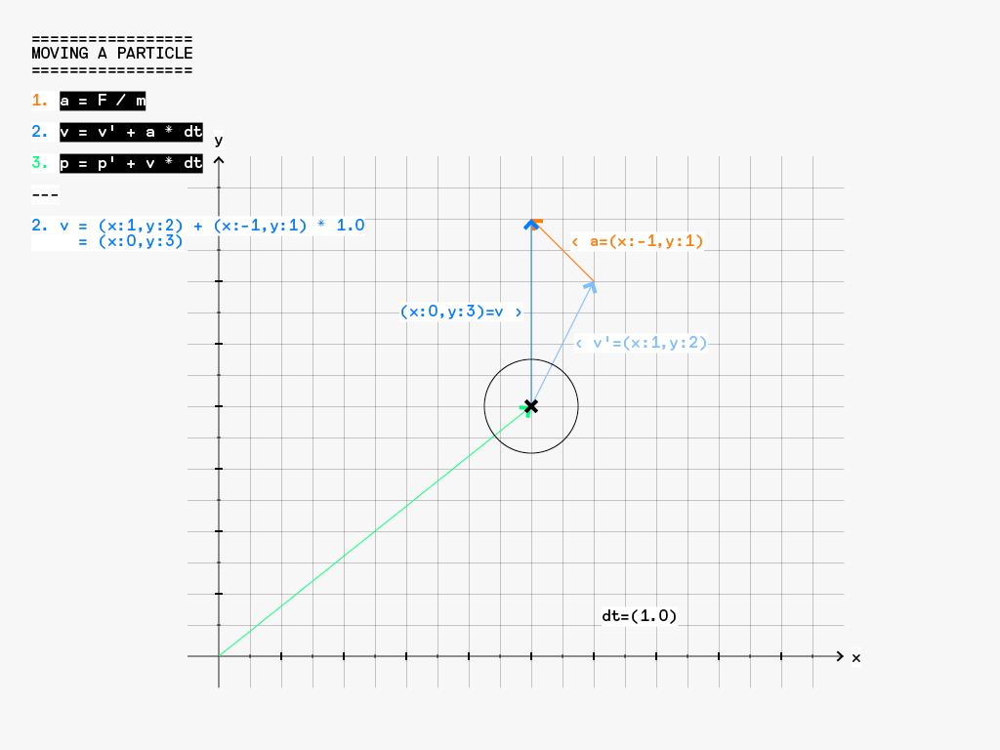

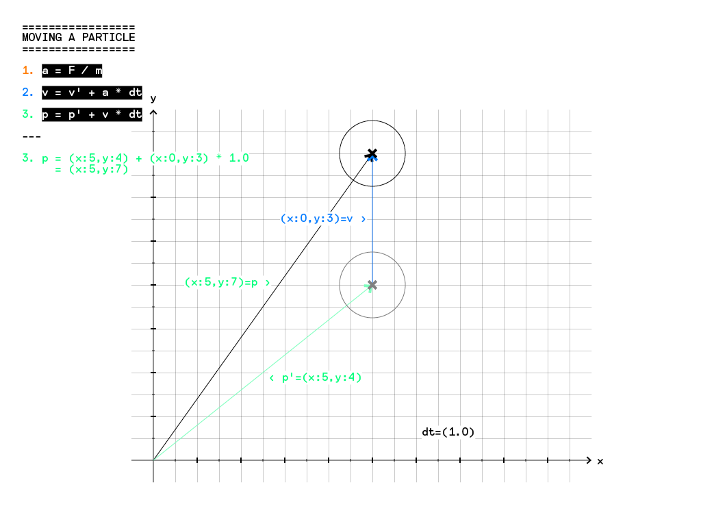

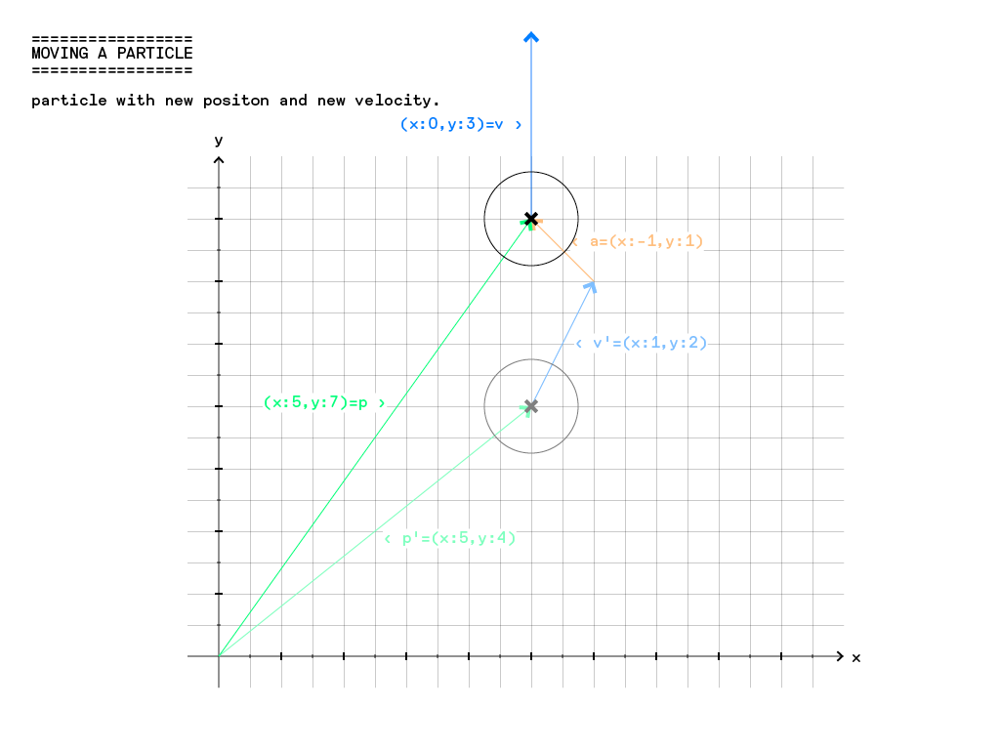

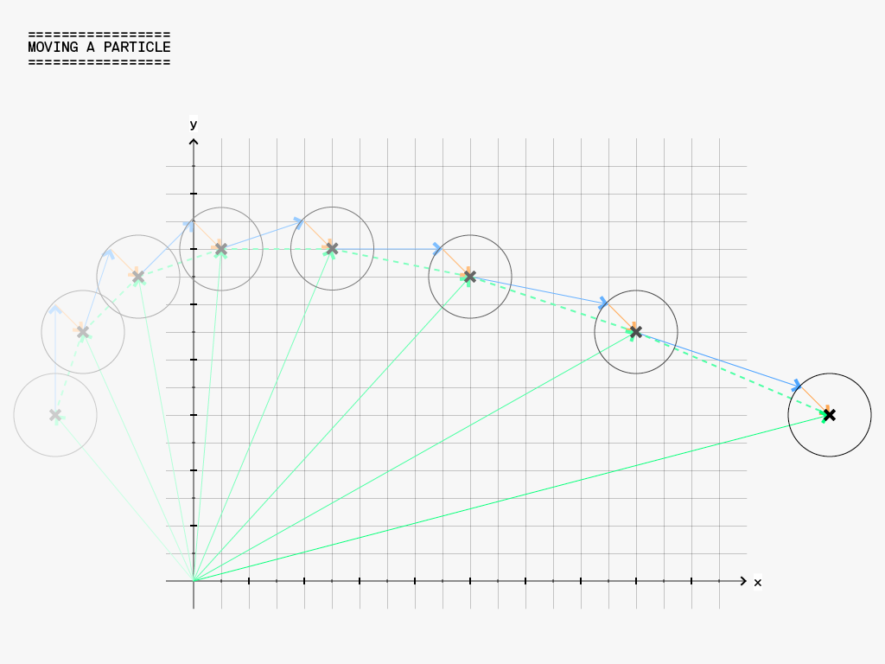

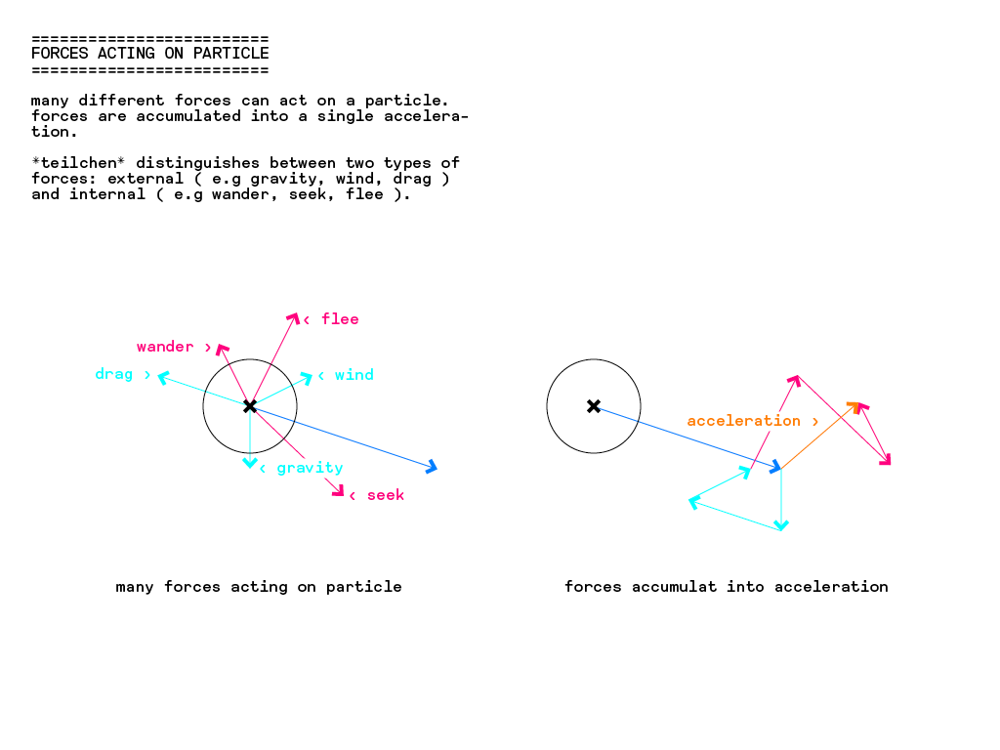

## reference

generated [reference](http://dennisppaul.github.io/teilchen/) of the library
